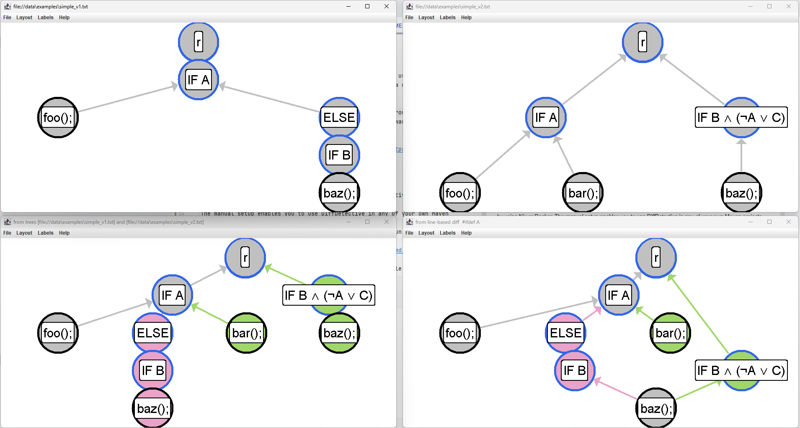

# Setup Instructions

You may run the demo manually, or by using Nix or Docker.
The manual setup enables you to use DiffDetective in any of your own Maven projects.
The Nix and Docker setups just build the demo for you to run it.

## Manual Setup

Check the requirements needed for the manual setup in the [REQUIREMENTS.md](REQUIREMENTS.md) file.

Follow the setup instructions on the [DiffDetective website](https://variantsync.github.io/DiffDetective/).
These instructions make you clone the repo and install it.
Afterward, come back here and you should be ready to go.

If you want an empty demo template project to implement the demo yourself, or to use DiffDetective for other purposes, you may
switch to the `empty` branch.
The `main` branch contains the full demo source code.

## Docker Setup

Check the requirements needed for the Docker setup in the [REQUIREMENTS.md](REQUIREMENTS.md) file.

You can use the `docker.sh` script to build and execute the Demo using [Docker](https://www.docker.com/get-started) as described below.

### Hints for Linux users
The following hints apply for most Linux users:
> You might require elevated privileges to execute Docker commands (e.g., `sudo ./docker.sh build` or adding the user to the `docker` or `wheel` group).
> See Docker's [post-installation steps](https://docs.docker.com/engine/install/linux-postinstall/) for more information.

> It is best to install required software (e.g., Docker, Maven) using your distro's package manager if it is available.

### Setup
Clone and navigate to this repository.
Then, simply build the image using the provided script:
```shell
./docker.sh build
```

This will automatically build the Docker container using Nix if Nix is installed on your system.

### Execution
Once the image has been build, you can start the demo with
```shell
./docker.sh demo
```

## Nix Setup

Nix can be used to reproducibly build both, a standalone derivation and a docker container.
Nix aids in reproducible builds whereas Docker aids in reproducible execution.

To use Nix, you need to have [Nix](https://nixos.org/download/) installed on your system.
See [REQUIREMENTS.md](REQUIREMENTS.md) for instructions on how to install Nix and optionally also Docker.

### Standalone Build

If you have flake's enabled, you can just use
```shell
nix run https://github.com/VariantSync/DiffDetective-Demo.git#.
```

Otherwise, clone and navigate to this repository.
Then simply build and run the Demo using
```shell
nix-build
./result/bin/DiffDetective-Demo
```

### Using a Docker Image

If you have Nix installed, the `docker.sh` script will automatically build this demo using Nix.
Hence, the instructions are the same as for docker:
Clone and navigate to this repository and execute the following:
```shell
./docker.sh build
./docker.sh demo
```


## Expected Output

The expected output is close to the output shown at the end of the [screencast](https://www.youtube.com/watch?v=q6ight5EDQY).
When you run the demo, a text-based diff should be printed to the terminal, followed by four windows opening up:
.
After closing these windows (use `ESC` key for fast closing), there should be another four windows opening with the same trees and diffs but not in the simplified "foo/bar" version.
After closing these windows, a small example analysis of the xterm repository should run in the terminal.
The analysis should take about 30s-5min, and its output to terminal should look similar to this:
```
2024-04-27 11:40:46 INFO    [AnalysisRunner.run] Reading and cloning git repositories from/to: data\repos
2024-04-27 11:40:46 INFO    [AnalysisRunner.run] Writing output to: data\output
2024-04-27 11:40:46 INFO    [AnalysisRunner.run] Loading datasets file: data\demo-dataset.md
2024-04-27 11:40:46 INFO    [AnalysisRunner.run] Performing validation on the following repositories:
2024-04-27 11:40:46 INFO    [AnalysisRunner.run]   - xterm from https://github.com/DiffDetective/xterm.git
2024-04-27 11:40:46 INFO    [AnalysisRunner.run] Preloading repositories:
2024-04-27 11:40:46 INFO    [Repository.load] Loading git at data\repos\xterm ...
2024-04-27 11:40:47 INFO    [Analysis.forEachRepository]  === Begin Processing xterm ===
2024-04-27 11:40:47 INFO    [Analysis.forEachCommit] >>> Scheduling asynchronous analysis on 8 threads.
2024-04-27 11:40:47 INFO    [Analysis.forEachCommit] <<< done in 0.222s
2024-04-27 11:40:47 INFO    [Analysis.forEachCommit] >>> Run Analysis
2024-04-27 11:41:21 INFO    [DemoAnalysis.endBatch] Batch done: 11 commits analyzed
2024-04-27 11:41:38 INFO    [DemoAnalysis.endBatch] Batch done: 20 commits analyzed
2024-04-27 11:41:39 INFO    [DemoAnalysis.endBatch] Batch done: 20 commits analyzed
2024-04-27 11:41:39 INFO    [DemoAnalysis.endBatch] Batch done: 20 commits analyzed
2024-04-27 11:41:40 INFO    [DemoAnalysis.endBatch] Batch done: 20 commits analyzed
2024-04-27 11:41:40 INFO    [DemoAnalysis.endBatch] Batch done: 20 commits analyzed
2024-04-27 11:41:40 INFO    [Analysis.forEachCommit] <<< done in 53.09s
2024-04-27 11:41:40 INFO    [Analysis.exportMetadataToFile] Metadata:
    analysis: my analysis
    repository: xterm
    big diffs: 188
    runtime with multithreading in seconds: 53.09
    total commits: 111

2024-04-27 11:41:40 INFO    [Analysis.forEachRepository]  === End Processing xterm after 53.379s ===
2024-04-27 11:41:40 INFO    [AnalysisRunner.run] Done
```
The output files of the analysis should be located at [data/output](data/output).
