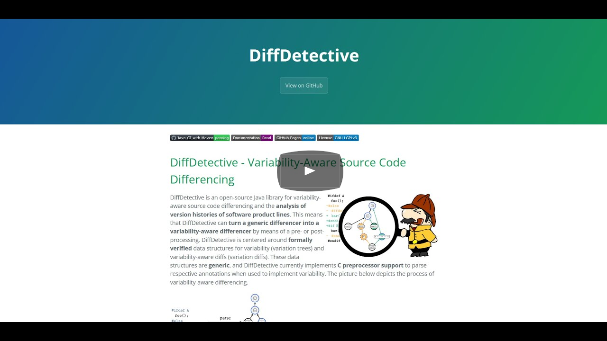

# DiffDetective-Demo

[][Preprint]

This is a small demonstration of [DiffDetective](https://github.com/VariantSync/DiffDetective).
The purpose of this demo is to provide an example of how to use DiffDetective and to serve as a template project for you to clone and adapt as a quickstart for developing with DiffDetective.

There is a screencast available on YouTube, guiding you through the demo's setup with Maven in IntelliJ and how to implement variability-aware differencing and analyses of Git histories:

To learn more about DiffDetective you may either head to it's [website][DiffDetectiveWebsite] or read our accompanying paper (a preprint is available [here][Preprint]):

> P. M. Bittner, A. Schultheiß, B. Moosherr, T. Kehrer, T. Thüm. _Variability-Aware Differencing with DiffDetective_. Demonstrations at International Conference on the Foundations of Software Engineering 2024, ⭐ [Best Demo Paper](https://2024.esec-fse.org/track/fse-2024-demonstrations?#Awards) ⭐, ACM, New York, NY, July 2024

## Setup

The demo is a Java Maven project, which includes DiffDetective as a library.

Software requirements are documented in the [REQUIREMENTS.md](REQUIREMENTS.md) file (there are no specific hardware requirements).
Basically, you will have to install Java and Maven, or alternatively Nix or Docker.

Installation instructions are documented in the [INSTALL.md](INSTALL.md) file.

[Preprint]: https://github.com/SoftVarE-Group/Papers/raw/main/2024/2024-FSE-Bittner.pdf
[DiffDetectiveWebsite]: https://variantsync.github.io/DiffDetective/
